# README.md

<!-- @import "[TOC]" {cmd="toc" depthFrom=1 depthTo=6 orderedList=false} -->
<!-- code_chunk_output -->

* Contents:
    * [Introduction](#introduction)
    * [Repository Structure](#repository-structure)
    * [Setup Instructions](#setup-instructions)
    * [Usage](#usage)
<!-- /code_chunk_output -->


## Introduction:
Using Jenkins to automate the process of building, testing and deploying a microservice application to Docker, Kubernetes for the NT548.P11 course - Fall 2024 semester at University of Information Technology - VNUHCM.


## Repository structure:
```txt
CI-CD-pipeline-with-Jenkins
  ├── app
  │   ├── main.py
  │   ├── schema.py
  │   └── utils
  │       ├── __init__.py
  │       ├── data_processing.py
  │       └── logging.py
  ├── assets
  ├── deployment-helmchart
  │   ├── .helmignore
  │   ├── Chart.yaml
  │   ├── templates
  │   │   ├── _helpers.tpl
  │   │   ├── deployment.yaml
  │   │   ├── hpa.yaml
  │   │   ├── ingress.yaml
  │   │   ├── NOTES.txt
  │   │   ├── service.yaml
  │   │   ├── serviceaccount.yaml
  │   │   └── tests
  │   │       └── test-connection.yaml
  │   └── values.yaml
  ├── Dockerfile
  ├── Jenkinsfile
  ├── models
  │   └── model.pkl
  ├── README.md
  ├── requirements.txt
  └── tests
      └── test_model_correctness.py


```

## Setup Instructions:
1. **Create EC2 instances on AWS Console:**
   - We need to create 2 EC2 instances: one for Jenkins and one for SonarQube.

   - Go to the EC2 section in AWS.
   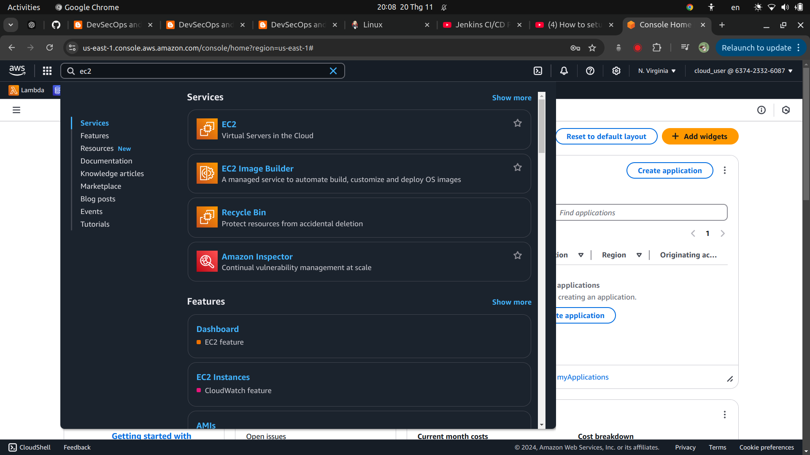

   - Click on ``Launch instances``.
   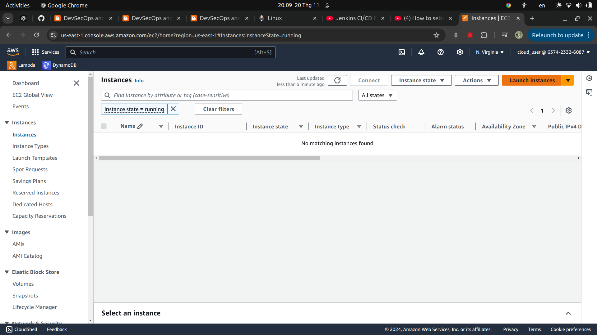

   - The first EC2 instance is named ``Group12-Jenkins``.
   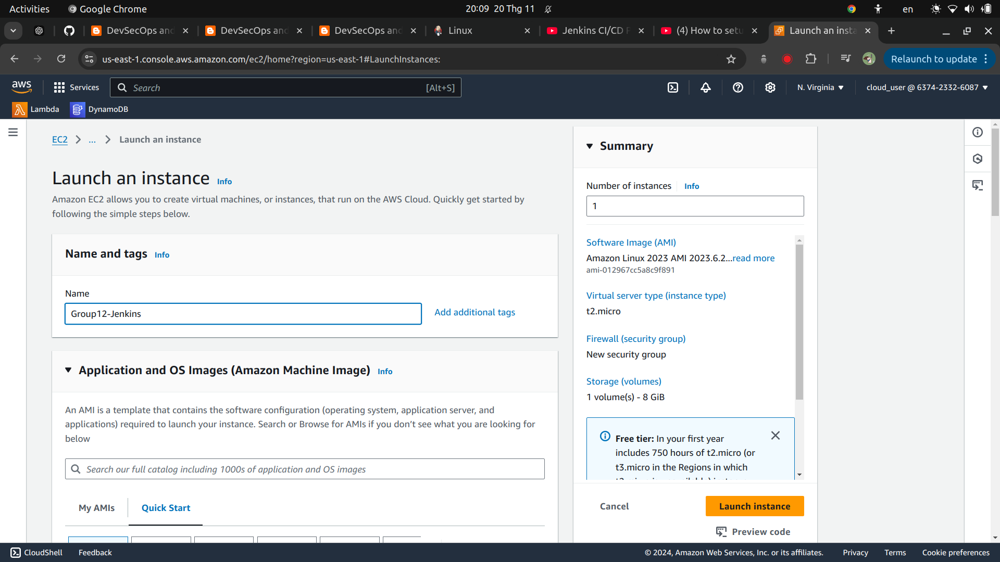

   - The Jenkins EC2 uses Ubuntu 22.04.
   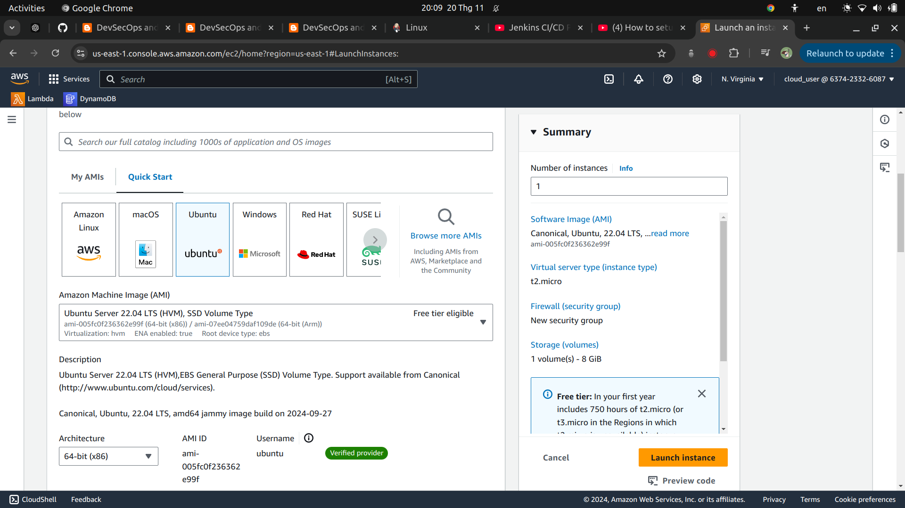

   - We choose the instance type ``t2.small``.
   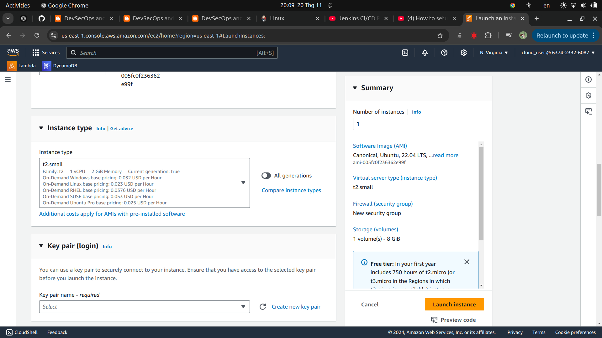

   - Now create a key pair so that we can connect to the EC2 later.
   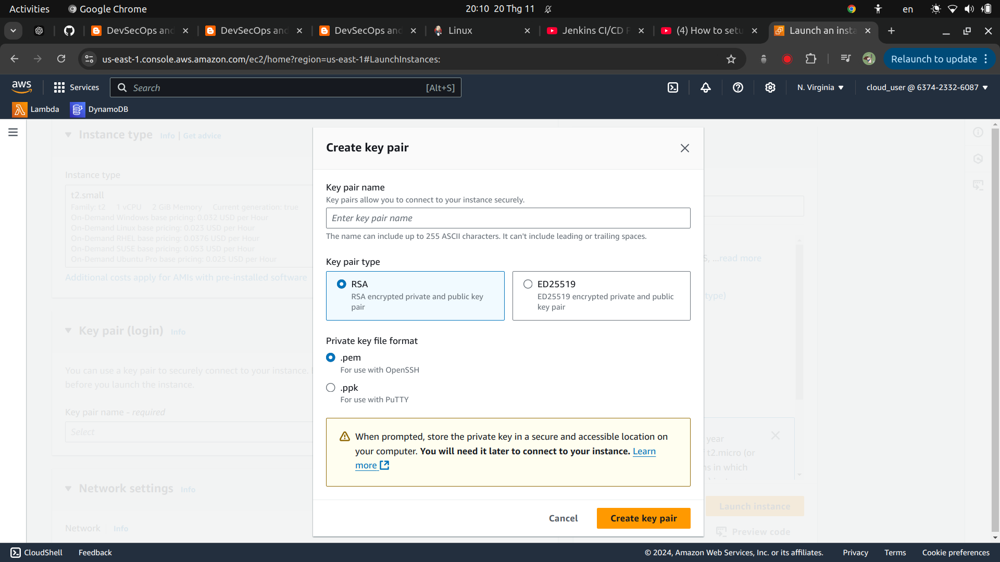

   - Configure the storage with 25 GiB and create the instance.
   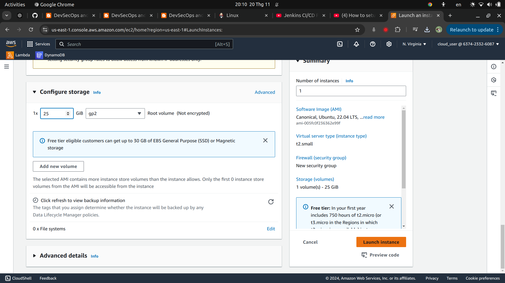

   - Go to ``Security`` section in the Jenkins instance and click on the ``Security groups`` to edit it.
   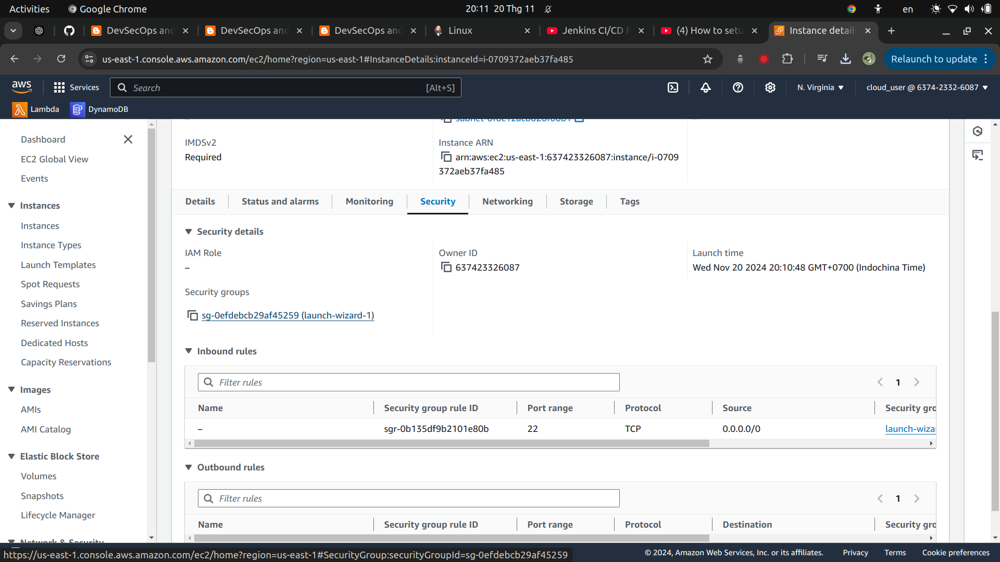

   - Add a rule with Port range 8080, so that we can access Jenkins on this EC2 using port 8080.
   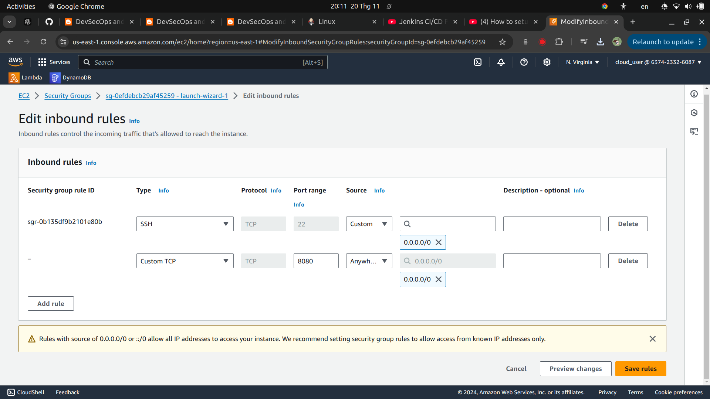

   - Now, the same as Jenkins EC2, we create a EC2 named as ``Group12-SonarQube``, with Ubuntu 22.04. The instance type is ``t2.medium`` to avoid some errors when setting up SonarQube. Also, add a new rule with port 9000 in `` Security group``.
   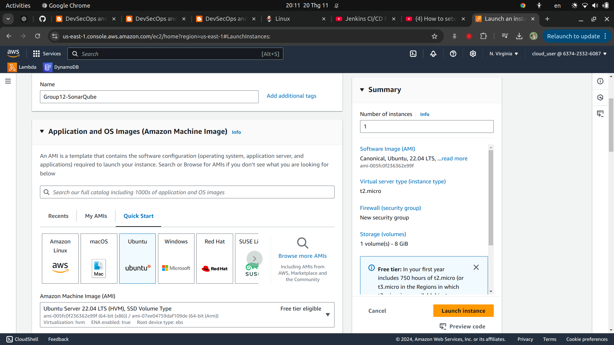
   
   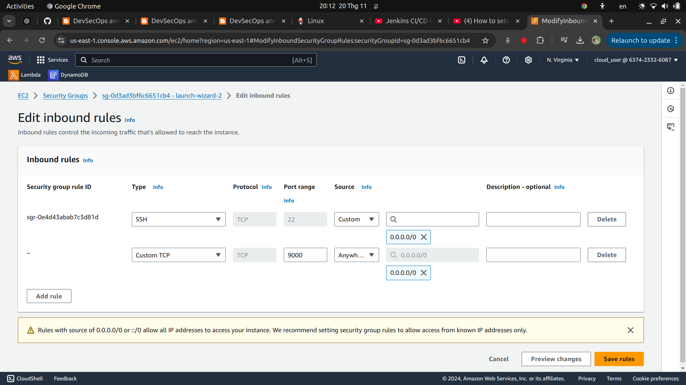

2. **Setting up Jenkins inside the Group12-Jenkins instance:**
   - Go to the repository settings on GitHub.
   
   - Navigate to the "Environments" section.
   
   - Add the following secrets:
     - `AWS_ACCESS_KEY_ID`
     - `AWS_SECRET_ACCESS_KEY`
     - `AWS_REGION` (e.g., `us-east-1`)

      

## Usage:
1. **Clone the Repository:**
   ```bash
   git clone https://github.com/meowwkhoa/vpc-terraform-github-actions.git
   cd vpc-terraform-github-actions
   ```

2. **Create a New Branch:**
   ```bash
   git checkout -b test
   ```

3. **Make Changes and Push:**
- Make any necessary changes to the code.
- Stage and commit the changes:
   ```bash
   git add .
   git commit -m "test"
   git push origin test
   ```    

4. **Create a Pull Request:**
- Go to the repository on GitHub.
- Create a pull request from the `test` branch to the `main` branch.

5. **Monitor Deployment:**
   - The GitHub Action will trigger automatically.
   - Logs of the GitHub Action automatic deployment.
   
   - Monitor the infrastructure changes in the AWS Management Console.
   
   - Our infrastructure ``VPC group 12``.
   

   - Subnet ``VPC group 12``.
   

   - Internet Gateway ``IGW group 12``.
   

   - Public Routable ``Public Routable group 12`` and Private Routable ``Private Routable group 12``.
   

   - NAT Gateway ``Group-12-NAT-Gateway``.
   

   - Elastic IP `Group-12-NAT-EIP`.
   

   - Public Instance `Public Instance group 12` and Private Instance `Private Instance group 12`.
   

   - Public Security Group `Group 12: Public Security Group` and Private Security Group `Group 12: Private Security Group`.
   

6. **Running a security scan with Checkov**
   - The Github Action will trigger automatically.
   - Logs of the scanning process.
   